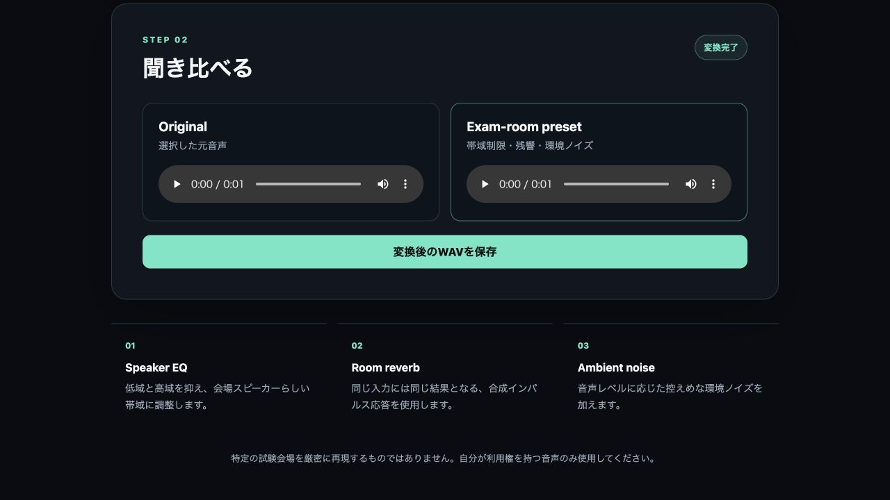
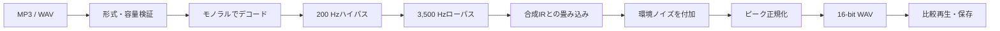

# Listening Environment Simulator

クリアな教材音声へスピーカー帯域制限・室内残響・低レベルの環境ノイズを加え、試験会場のような聞き取りづらさで練習するためのローカル音声変換ツールです。

普段のイヤホン学習と、広い部屋のスピーカーから流れる本番音声との違いを事前に体験したい、という自身の課題から開発しました。MP3またはWAVを選ぶと、元音声と変換後の音声をブラウザ上で聞き比べ、結果をWAVとして保存できます。



> **ローカル実行専用です。** 音声を外部サービスへ送信せず、処理中の一時ファイルも変換完了時に削除します。

## 主な機能

- MP3・WAV音声の読み込み
- 200 Hz以下と3,500 Hz以上を抑えるスピーカー帯域シミュレーション
- 合成インパルス応答を使った室内残響
- 入力音量に応じた低レベルの環境ノイズ
- 元音声と処理後音声のブラウザ内比較
- 変換結果のWAVダウンロード
- 25 MB・20分の入力制限
- デスクトップとスマートフォンに対応したUI

## 設計判断とトレードオフ

### 1. 実在する教材音声をリポジトリへ含めない

音声教材には著作権や再配布条件があります。デモの分かりやすさより権利保護を優先し、サンプル音声や変換結果をGit履歴にも含めない構成にしました。利用者自身が利用権を持つ音声を指定します。

### 2. 公開サーバーではなくlocalhostで動かす

アップロードされた音声は`127.0.0.1`上のFlaskへだけ送られます。外部ストレージや解析サービスは使用しません。不特定多数が大容量の信号処理を実行する運用負荷を避ける代わりに、利用前のローカルセットアップが必要です。

### 3. 一時ファイルを処理単位で破棄する

入力音声はOSの一時ディレクトリへ保存しますが、変換処理の終了時に成功・失敗を問わず削除します。出力はメモリ上でWAV化してレスポンスし、サーバーへ永続保存しません。これにより再ダウンロード用URLは持てませんが、音声の残留と掃除処理の複雑さを減らせます。

### 4. 再現性のある合成音響を使う

残響と環境ノイズは固定シードで合成するため、同じ入力からは同じ結果が得られます。実測した会場のインパルス応答より再現精度は低い一方、配布権、追加ファイル、環境差に依存せずテストできます。

### 5. 出力をMP3ではなくWAVにする

MP3書き出しは環境によって外部エンコーダーが必要です。出力サイズは大きくなりますが、追加の実行環境に依存せず、非可逆圧縮を重ねないWAVを採用しました。

## 信号処理パイプライン



残響の末尾を保持するため、出力音声は入力より約0.35秒長くなります。

## データの扱い

- 入力音声はlocalhost以外へ送信しません。
- 入力の一時ファイルは処理終了時に削除します。
- 変換結果はメモリ上で生成し、ブラウザへ直接返します。
- データベース、外部API、クラウドストレージは使用しません。
- ファイル名は安全な形式に正規化してから出力名へ使用します。
- 内部例外の詳細は利用者へ返さず、固定メッセージを表示します。

## 技術構成

| 分類 | 使用技術・方針 |
| --- | --- |
| バックエンド | Python 3.12 / Flask |
| 信号処理 | NumPy / SciPy / librosa |
| 音声入出力 | SoundFile |
| フロントエンド | HTML / CSS / Vanilla JavaScript |
| テスト | Python `unittest` / Flask test client |
| 保存 | 永続保存なし |

## セットアップ

### 必要なもの

- Python 3.12
- ローカルブラウザ

### 起動方法

```bash
git clone https://github.com/kento311/listening-environment-simulator.git
cd listening-environment-simulator
python3 -m venv .venv
source .venv/bin/activate
python -m pip install --requirement requirements.txt
python app.py
```

ブラウザで <http://127.0.0.1:8000> を開きます。

## テスト

```bash
python -m unittest discover -s tests -p "test_*.py" -v
```

テストでは実在の教材音声を使用せず、コード内で生成した短い正弦波を使います。音響処理の再現性、出力形式、入力制限、エラー境界を検証します。

## ディレクトリ構成

```text
.
├── app.py                         # Flask画面と音声変換API
├── services/
│   └── audio_processing.py       # EQ・残響・ノイズ・正規化
├── templates/
│   └── index.html                # 画面構造
├── static/
│   ├── app.js                    # ファイル選択・API通信・再生
│   └── styles.css                # レスポンシブUI
├── tests/
│   ├── test_app.py               # HTTP APIとエラー境界
│   └── test_audio_processing.py  # 信号処理の単体テスト
└── docs/images/                  # README用の画面画像
```

## 制約

- 特定の試験会場を音響学的に厳密再現するものではありません。
- 入力はモノラルへ変換されます。
- 8,000 Hz未満のサンプリングレートには対応しません。
- 長い音声ほど処理時間とメモリ使用量が増えます。
- MP3の読み込み可否は、Python環境に含まれる音声デコーダーに依存します。

## 開発で重視したこと

AIツールは、信号処理方法の比較、実装案の検討、テスト観点の洗い出しに活用しました。一方で、解決する課題の定義、教材音声を公開しない判断、ローカル実行と一時ファイル破棄の設計、変換結果の検証は自分で行っています。

機能の多さだけでなく、扱うデータの権利、処理負荷、再現性、環境依存性を整理し、安全に説明できる範囲を決めることを重視しました。
